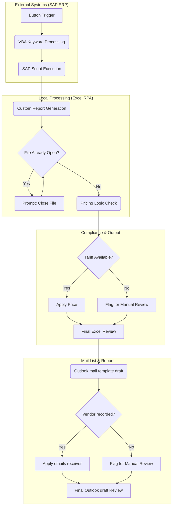

# TPRM Last-Mile Automation: SAP-Excel-Outlook
Conceptual framework for an automation system designed to bridge ERP data silos with automated compliance reporting

## Project Overview
In Third-Party Risk Management, manual data entry is a significant bottleneck. This project documents a "last-mile" automation workflow designed to bridge the gap between **SAP (ERP)** and **Outlook (Reporting)**.

## Workflow Diagram 

## Business Impact
* **Efficiency:** Reduce 80% of manual workflow filing.
* **Accuracy:** Eliminated copy-paste errors in sensitive pricing.
* **Compliance:** Ensured real-time notification for non-agreed rates.

##Project Roadmap & Future Enhancements
​This framework is designed for modular growth. Current development is focused on scaling data volume and diversifying input sources:
Phase 1 (Completed): Core ERP-to-Reporting Pipeline. Developed logic for data merging, pricing validation, and automated email drafting with 100% data integrity.
Phase 2 (In Development): DuckDB Integration. Migrating local storage from flat files to DuckDB to enable high-speed analytical queries on multi-year procurement datasets.
Phase 3 (Upcoming): OCR Module. Implementing Tesseract-based OCR to ingest digital assessments and quotations into the digital pipeline.
Phase 4 (Exploratory): Local LLM Agent. Testing Ollama/AzureAI integration via REST API for automated document analysis on multi-year sourcing datasets.

---
*Note: This repository contains logic frameworks and pseudocode to demonstrate technical proficiency. Proprietary company code is not included.*
