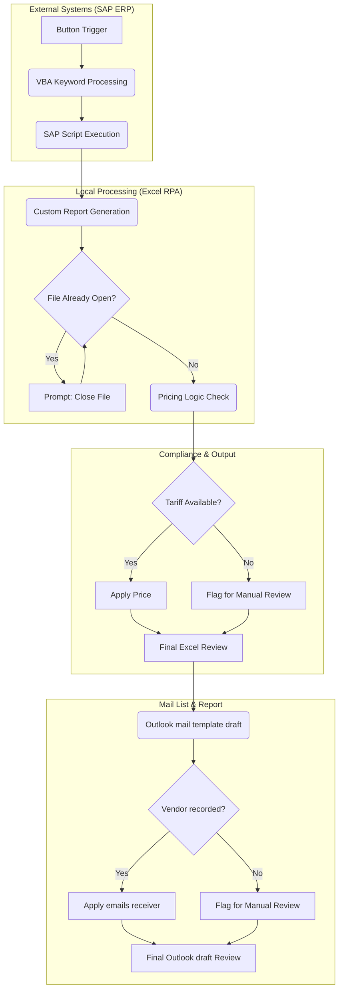

# TPRM Last-Mile Automation: SAP-Excel-Outlook
Conceptual framework for an automation system designed to bridge ERP data silos with automated compliance reporting

## Project Overview
In Third-Party Risk Management, manual data entry is a significant bottleneck. This project documents a "last-mile" automation workflow designed to bridge the gap between **SAP (ERP)** and **Outlook (Reporting)**.

## Workflow Diagram 

## Business Impact
* **Efficiency:** Reduce 80% of manual workflow filing.
* **Accuracy:** Eliminated copy-paste errors in sensitive pricing.
* **Compliance:** Ensured real-time notification for non-agreed rates.

---
*Note: This repository contains logic frameworks and pseudocode to demonstrate technical proficiency. Proprietary company code is not included.*
